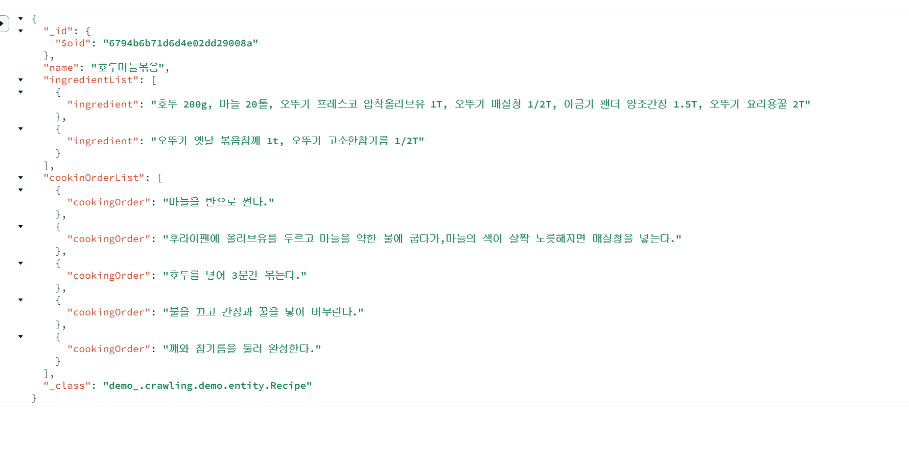

## :punch: 추가기능 생각한거

- 깊게 생각은 안함
- 크롤링 관련 찾아보다가 레시피 사이트 구현한 프로젝트가 너무 흔한(?) 느낌이라 추가할 거 생각

### :punch: 원 재료 영양정보 계산기

- 영양성분 DB가 존재하는 것 보고 생각

### :punch: 조리법 반영 예상 영양정보 계산기

https://www.data.go.kr/data/15100064/standard.do#/tab_layer_open

### :punch: Gemini 활용하여 영양분에 따른 그런거

### :punch: Gemini 활용한 조리 시 주의사항

### :punch: DB 외의 레시피 검색(검색 결과 없을 시)

### :punch: 기타 데이터 크롤링 결과 -> 추가적으로 진행하려다 변경될 수 있을거 같아서 진행 X

```JAVA
@Service
@AllArgsConstructor
@Slf4j
public class RecipeService {
    private final RecipeRepository recipeRepository;

    public void crawRecipes() throws IOException {
        String url = "https://www.okitchen.co.kr/category/detail?page=1&sort=&idx=1094";
        Document doc = Jsoup.connect(url).ignoreContentType(true).userAgent("Mozilla/5.0").get();


        Element content = doc.select("div.content.detailBody").first();
        if (content == null) {
            // content 없을시
            log.info("Content not found");
            return;
        }

        // 이름
        String foodname = content.select("div.detailInfo h2").text();
        log.info("Name: " + foodname);


        // 재료
        List<Ingredient> ingredients = new ArrayList<>();
        Elements ingredientElements = content.select("div.ingredients p");
        log.info("Ingredients count: " + ingredientElements.size());
        for (Element ing : ingredientElements) {

            ingredients.add(Ingredient.builder()
                    .ingredient(ing.text())
                    .build());
            log.info("Ingredient: " + ing.text());
        }


        // 조리순서
        List<CookingOrder> cookingOrders = new ArrayList<>();
        Elements orderElements = content.select("div.ContentArea p");
        log.info("Steps count: " + orderElements.size());
        for (Element order : orderElements) {
            if(order.text().contains("Step") || order.text().isBlank()){
                continue;
            }
            cookingOrders.add(CookingOrder.builder()
                    .cookingOrder(order.text())
                    .build());
            log.info("Step: " + order.text());
        }

        Recipe recipe = Recipe.builder()
                .name(foodname)
                .ingredientList(ingredients)  // List<Ingredient>
                .cookinOrderList(cookingOrders)  // List<CookingOrder>
                .build();

        recipeRepository.save(recipe);


    }
}

```

## :punch: Mongo DB 저장 결과


