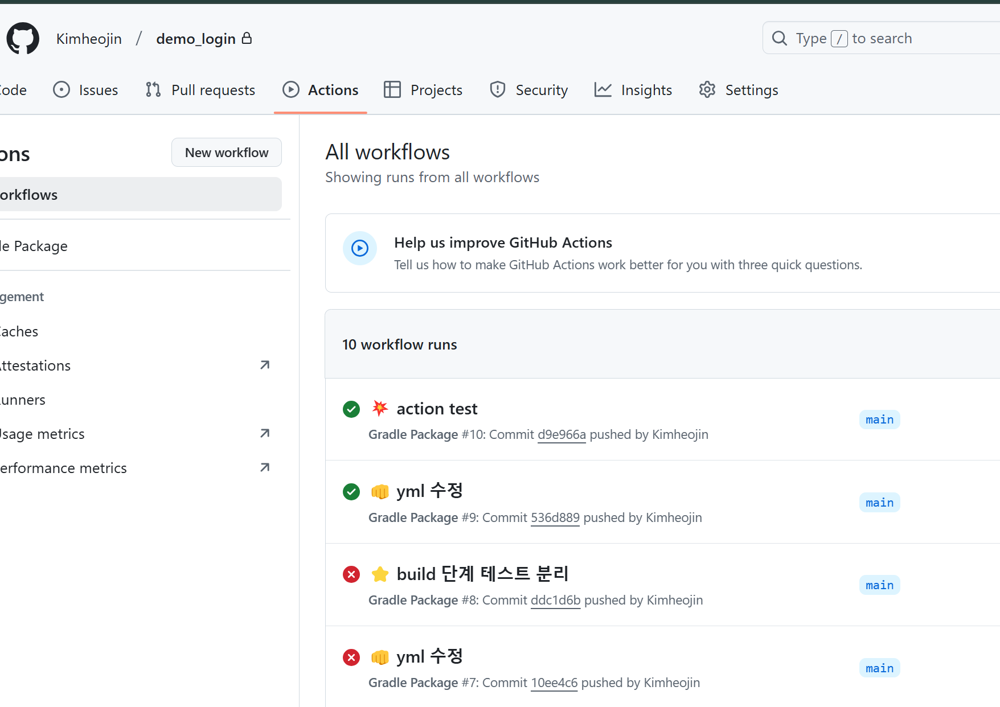
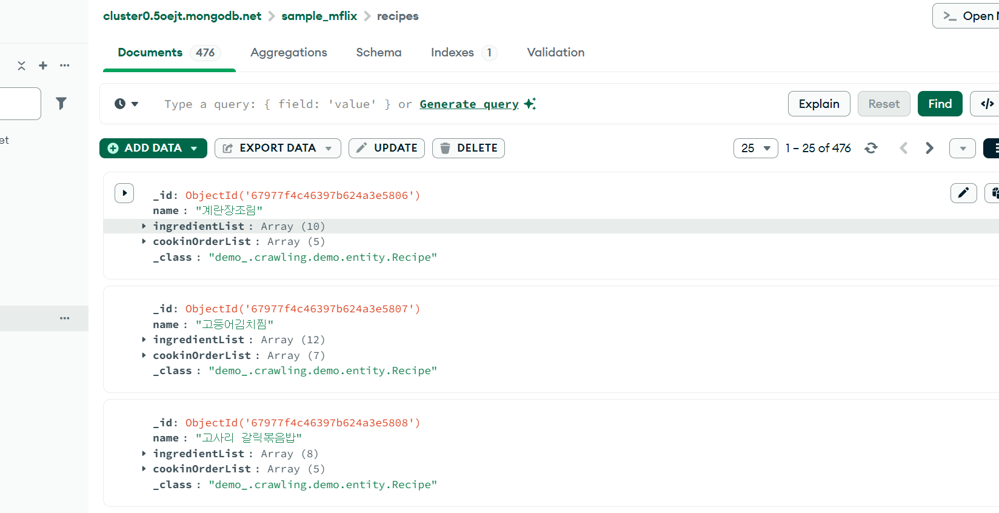

# 진행 상황 📊

### spring_login server git hub actions 적용 🔄

- OAuth2 구현 하기 전에 테스트 코드 완성 하고 구현할듯..?
- 다담주 까지 마무리 OAuth2 마무리 할꺼 같음 ✅

### 크롤링 서버 관련 🕷️

- 오키친 사이트에서 476개 레시피 크롤링 완료 🎉
  
- 오키친 사이트 관련 코드는 완료 되어서 세부사항 정해지면 스케쥴러 구현 할거 같음 ⚙️
- 타 요리사이트 몇개 조사함(링크정도)
- 추가로 데이터 필요 시 크롤링 할듯(만약 필요 시 금방 할거 같음 한번 해봐서) 📚

### 프론트 관련 💻

- 이번주에 딱히 뭐 없으면 로그인 서버 진행한 부분까지 진행할 계획
- 테스트 까진 진행 못할수도 🤔

# 정해야 할 거 📝

1. 냉장고 파먹기 기능 이름 뭐로 정할지 🔍

- 만들 수 있는 요리 찾기
- 재료로 뭐 만들지??

2. 현재 MongoDB 저장형식에 추가하고 싶은 요소 혹은 건의사항 있는지 💭

- 나중에 카테고리별로 정렬 할 일 있을수도 있을거 같아서 카테고리 관련 정보 크롤링 할 수 있는 환경이면 크롤링 하고 싶음
- 재료 관련 데이터 정제 프로세스를 실행한 후 재료에 index를 붙여서 검색 기능 관련 기능을 개선하고 싶음
- 데이터 정제 프로세스 관련 -> 오뚜기 참기름 -> 이런 이름이 재료명에 너무 많음 🧹

3. 사이트 전체적인 색감 어떤 색으로 하고 싶은지 🎨

- 노란색 계열(따듯한 느낌..?) -> 오키친 사이트가 맘에 들어서 개인적으로
- 다크한 계열..?(구현하기 쉬움)

4. 사이트 이름 뭐로 할지 ✨

- 레시피 메이트
- 쿡인메이트
- 쿠킹메이트
- 함께쿡쿡

5. 전체 레시피 개수 -> 난 1000개정도..? 📚
