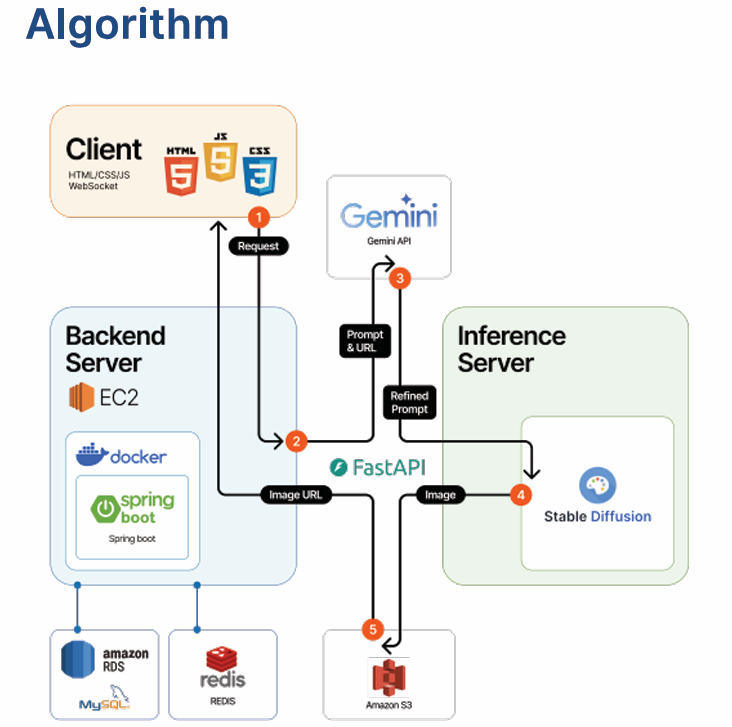
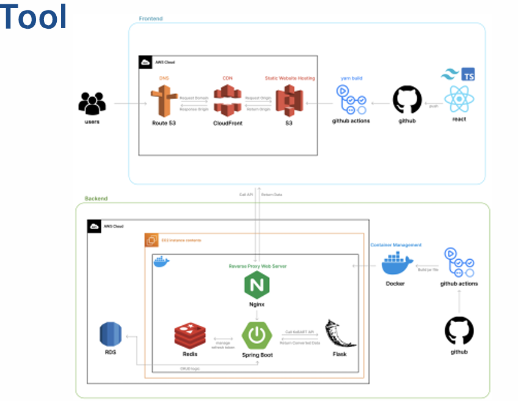
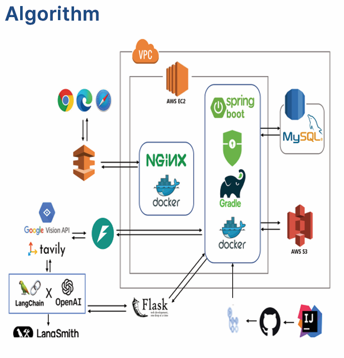

# 프로젝트 관련

## 사람

- 이상록
- 허진

## 예상 기술스택(?)

### 프론트엔드

vue.js

### 백엔드

FastAPI(Nginx랑 결합해서 많이 하는 듯, 아직 안찾아봄), Spring,

### DB

Postgresql, mysql, redis

### 협업툴

자랑은 아닌데 안찾

### 기타

docker, github actions, kubernates

## 예상 기술(?)//주제 안정해서 몰겠음

### 로그인 관련

Ouath 2.0 + JWT(?)

### AI 관련(혹시나 해서)

Gemini api 찾아보니 무료버전도 상용화 안할꺼면 쓸만할듯

## 참고용으로 찾은 사진(졸프 책자 위주)

## 기타 느낀점

- 만약에 졸프 다시하면 김태형 교수님 1순위 할듯
- 이장호 교수님쪽에 던지신 분들 많은듯
- ci/cd 는 Jenkins 아니면 github action 상황에 맞게 써야할듯
